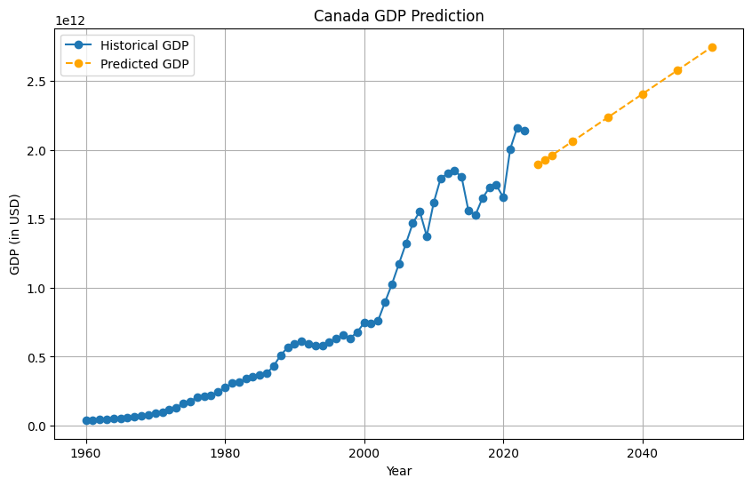

# Canada's GDP Prediction Project

### Practice using pandas, matplotlib, scikit-learn

## 2025-06-13

Implemented loading and reshaping the data, model preperation and test visualization comparing it to the official graph.

Starting to learn about splitting data into training and testing sets

## 2025-06-14

Learned and implement about training a Linear Regression Model, although understanding just reached the surface

Learned and implement model evaluation to check the accuracy of the model.

Implemented Graphs: Actual vs Predicted and Residual vs Predicted

## 2025-06-15

Attempted Future predictions for the years [2025], [2026], [2027], [2030],[2035], [2040], [2045], [2050]

Implemented a Canada GDP Prediction Graph with histroical data and predicted data

    - Linear function does not seem suitable
    - However I think this is fine for first timer

Attempted improving model using Log Transformation however I do not have enough knowledge and know hows as to why it works and how to implement it.

    - I will hold it off for another day and maybe for different project

## FINISHED 2025-06-15

   Year  GDP (Trillions USD)
0  2025             1.892788
1  2026             1.926968
2  2027             1.961147
3  2030             2.063685
4  2035             2.234581
5  2040             2.405477
6  2045             2.576373
7  2050             2.747269

### Notes:

Personally I think this project was a success. I learnt how to somewhat use the libraries, pandas, matplotlib, sklearn and numpy.

    - Learned loading datasets and reshaping the dataframe
        - such as converting values and droping missing values
    - Learned simple workflow (Although I do not know if it is optimized since I don't have anything to compare it to)
        - Modeling Preperation
        - Test Visualization as a sanity check
        - Data splitting into training and testing sets
        - Training Linear Regression Model from scikit-learn
        - Predicting values
        - Model evaluation (Got worse after trying to implement log transformation)
        - More graph visualizaiton for checks (To be honest I still don't fully understand the graphs as to what they tell me in terms of prediction?)
    
    - Learned how to get the future predictions
        - Made a new Canada GDP Prediction Graph, GDP(USD) vs Year, which as Historical GDP and Predicted GDP values
        - Also printed out a table for those values.